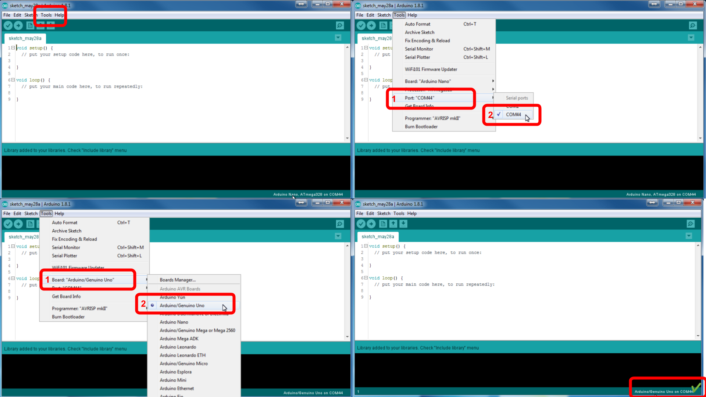
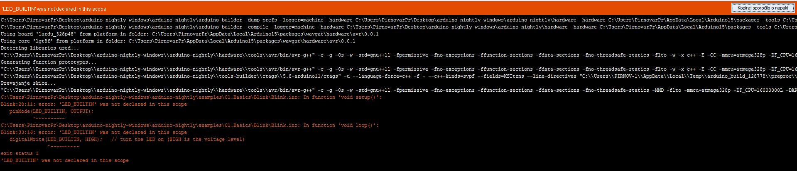

 Starting with Arduino IDE
--------------------------------------------------------------------------------

The Arduino platform is based on the Atmel AVR microcontroller family, and the Arduino Uno is based on the ATmega328 microcontroller. The Arduino Integrated Development Environment (IDE) is a software application that provides a way to write and upload code to the microcontroller. The Arduino IDE is available for Windows, macOS, and Linux, and it is open source.

Happy programming!

### Board setup

1. Connect the Arduino Uno to PC with proper USB cable.  
    `[Arduino Uno]` 
2. Make shure that you will set the proper settings (see [@fig:Arduino_basic_setup_IDE]). From the menu choose:  
    `Tools`-
    1.  `Board:` Arduino/Genuino Uno
    2.  `Port:` COM3

    {#fig:Arduino_basic_setup_IDE}

3. Open Arduino IDE program and open program with:  
    `Files -  Examples - 01. Basics - Blink.ino`
4. To upload the code you can click the icon `Upload`.  
    If the uploading was successful you will be prompted with the text
    like:  

```
Done uploading.  
Sketch uses 970 bytes (3%) of program storage space. Maximum
is 32256 bytes. Global variables use 9 bytes (0%) of dynamic
memory, leaving 2039 bytes for local variables. Maximum is
2048 bytes.
```

### Issues

#### LED_BUILTIN was not declared in this scope

{#fig:VAR_was_not_declared_IDE}

Compiler ne ve kaj naj bi bilo "LED_BUILTIN" ... na tem mesu naj bi bila številka priključka, ki ga želimo krmiliti. V tem primeru je to številka 13. Rešitvi sta lahko 2:

  1. vse LED_BUILTIN zamenjaš s 13 ali  
  2. v vrstico pred "void setup()" dodaj `const int LED_BUILTIN = 13;`

Zadnja (druga) rešitev je boljša, ker pripomore k berljivosti programa... Spremenljivka LED_BUILTIN se imenuje "razlagalna spremenljivka" ker pomaga razlagati program. Tako postane tisti komentar "// turn the LED on (HIGH is the voltage level)" nepotreben, saj sama koda pove točno enako.

