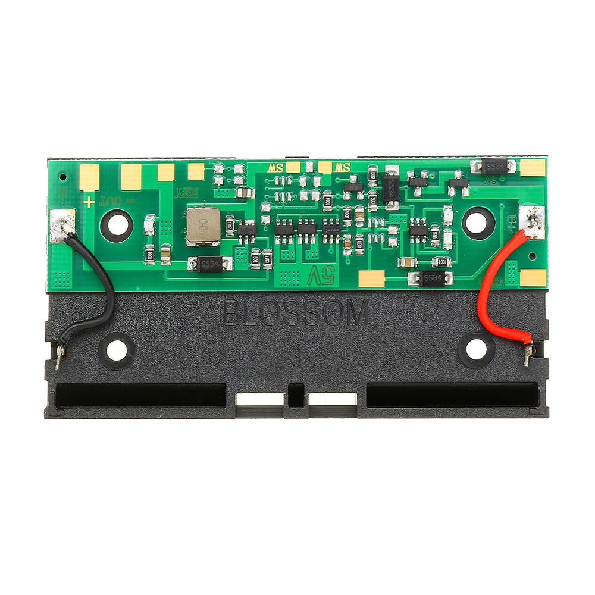
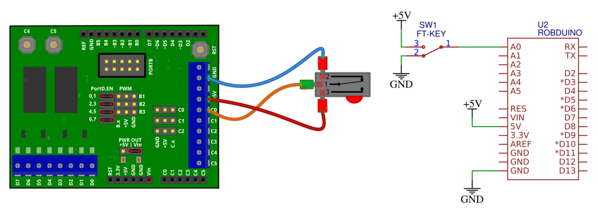
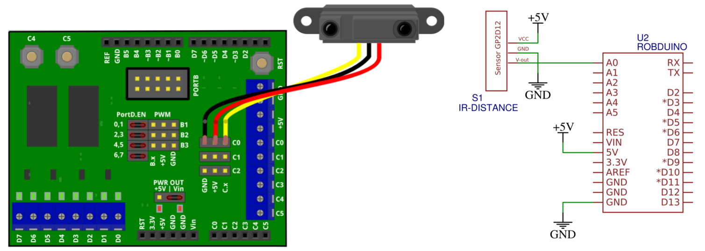

 Equipment testing
--------------------------------------------------------------------------------

Welcome to the chapter dedicated to the essential task of Equipment Testing for the Mobile Robot Construction Kit. In this chapter, we will guide you through the accurate evaluation of critical components such as the RobDuino controlling module, Battery supply, push button, light sensor, IR distance sensor, and i2c LCD. These elements form the core of your robot construction kit, hence ensuring their proper functioning is crucial for the overall performance of your mobile robot.

We'll delve deep into the intricate details of each component, including their functionality, testing parameters, and what you should look for in terms of optimum performance. By the end of this chapter, you'll have a thorough understanding of how to efficiently test and troubleshoot these key components of your mobile robot.

Don't forget, this is a resource you can always return to when you need guidance or a quick refresher. Ensuring that your equipment is working as it should is fundamental to the success of your mobile robot project, so feel free to revisit this chapter as needed. Whether you're a seasoned roboticist or a novice enthusiast, our detailed guide to equipment testing will prove to be a valuable tool in your robotics journey.

### RobDuino module

1. Na krmilnik Arduino Uno priključite modul `RobDuino` in naložite naslednji program:


```cpp
bool test_tipk = 1;
int l=1;

void setup() {
  for (int i = 0; i < 8; i++){
    pinMode(i, OUTPUT);
  }
  pinMode(A4, INPUT_PULLUP);
  pinMode(A5, INPUT_PULLUP);
  PORTD=1;
}

void loop() {
  char tipka_a4_is_pressed = !digitalRead(A4); 
  char tipka_a5_is_pressed = !digitalRead(A5); 
  if (tipka_a4_is_pressed) l = l >> 1;
  if (tipka_a5_is_pressed) l = l << 1;
  if (tipka_a4_is_pressed && tipka_a5_is_pressed) test_tipk = !test_tipk;
  if (test_tipk){
    if (l < 1) l = 128;
    if (l > 255) l = 1;
    PORTD = l; 
  }else{
    PORTD = analogRead(A0) >> 2;
  }
  delay(200);
}
```
: Equipment testing. {#lst:026_Equipment_testing}

2. Nato preverite delovanje obeh tipk (A4 in A5) na modulu in vrednosti izhodnih priključkov D0 .. D7.

### Napajalni modul

Napajalni modul uporablja 2x Li-ion akumulatorja tipa 18650. Spodnje tiskano vezje je prikazano [@fig:napajalni_modul].

{#fig:napajalni_modul width=8cm}

Dodatno smo ga opremili z:

1. 2.5mm jack priključkom za napajanje,
2. 3-pinskim priključkom za napajanje,
3. preklopnim stikalom za izbiranje načina delovanja:
    1. ON - izhod za 9V je kaktiviran
    2. OFF - izključen izhod 9V napajanja in omogočeno je polnenje akumulatorjev preko 3-pinskega priključka (5V).

Pomembno: Pred prvo uporabo moramo ročno aktivirati napajalni modul tako, da povežemo GND na 3-pinskem priključku in NEGATIVNI terminal akumulatorjev.

### Tipka

1. Priključite stikalo po shemi na [@fig:tipka_test].

{#fig:tipka_test}

2. Nato naložite naslednji program.

```cpp
void setup() {
    pinMode(A0, INPUT);
    pinMode(7, OUTPUT);
}

void loop() {
    char key_a0_is_pressed = digitalRead(A0);
    if (key_a0_is_pressed){
        digitalWrite(7, HIGH);
    } else{
        digitalWrite(7, LOW);
    }
    delay(100);
}
```

### Svetlobni senzor

1. Priključite foto-tranzistor v delilnik napetosti z uporom, kot prikazuje [@fig:foto_senzor_test].

{#fig:foto_senzor_test}

2. Nato naložite naslednji program in preverite odziv svetlobnega senzorja.

```cpp
 void setup() {
  pinMode(A1, INPUT);
  Serial.begin(9600);
}

void loop() {
  int light_senzor_value = analogRead(A1);
  Serial.println(light_senzor_value);
  delay(100);
}
```

3. Odziv senzorja spremljajte v oknu serijske komunikacije.

### IR senzor razdalje

1. IR senzor razdalje priključite na tri-pinski priključek kot je prikazano na [@fig:test_IR].

{#fig:test_IR}

2. Delovanje senzorja preskusite z naslednjim programom, njegov odziv pa spremljajte v oknu za serijsko komunikacijo.

```cpp
void setup() {
  pinMode(A0, INPUT);
  Serial.begin(9600);
}

void loop() {
  int distance_senzor_value = analogRead(A0);
  Serial.println(distance_senzor_value);
  delay(100);
}
```

### LCD (I2C)

1. Priključite LCD na I2C vodilo kot prikazuje 

{#fig:test_I2C_LCD_2}

2. Priskrbite si knjižnico `LiquidCristal-I2C` iz naslova:  
https://www.arduino.cc/reference/en/libraries/liquidcrystal-i2c/ 
3. Knjižnico dodajte v Arduino IDE okolje tako, da dodate `ZIP` datoteko v :  
`Sketch >> Include Library >> Add .ZIP Library`
3. V VSC in PlatformIO vtičniku si lahko knjižnico naložite tako, da v terminalno okno vpišete ukaz  
`pio lib install "marcoschwartz/LiquidCrystal_I2C@^1.1.4"`

4. Nato preskusite naslednji program:

```cpp
#include <Wire.h> 
#include <LiquidCrystal_I2C.h>
LiquidCrystal_I2C Lcd(0x27, 16, 2);

void setup() {   
    Lcd.init();
    
    Lcd.clear();
    Lcd.backlight();
    
    Lcd.setCursor(3,0);
    Lcd.print("Hello");
    Lcd.setCursor(6,1);
    Lcd.print("World");   
}

void loop() {
}
```

Če niste prepričani kateri i2c naslov uporablja naprava na LCD-ju le tega lahko preverite s programom `I2C scanner` (https://playground.arduino.cc/Main/I2cScanner/). Običajno I2C LCD-ji, ki jih naredijo kitajski proizvajalci uporabljajo Ilc naslov `0x27` , `0x3F` ali manj pogosto `0x38`.


