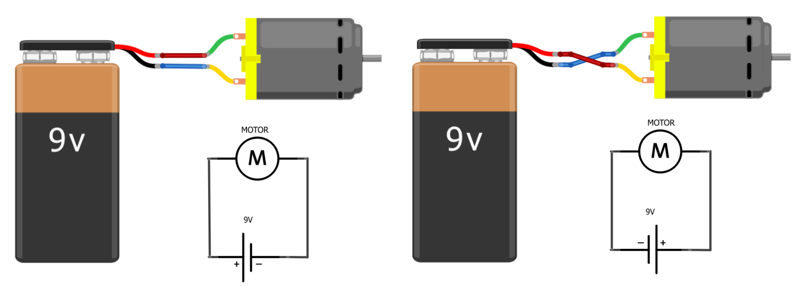

## Motor as main actuator

A DC motor (Direct Current motor) is an electrical machine that converts electrical energy into mechanical energy. It works by using electromagnetic principles to generate rotary motion.

Here is how a DC motor works in more detail:

- The DC motor has two main parts: the stator and the rotor. The stator is the stationary part of the motor, and the rotor is the rotating part.
- The stator consists of a coil of wire that is wound around a core. When an electric current flows through the coil, it creates a magnetic field around the core.
- The rotor consists of a permanent magnet or a coil of wire that is mounted on a shaft. When the rotor is placed inside the stator, the magnetic fields of the stator and the rotor interact with each other.
- If the stator's coil is energized with a DC current, the magnetic field it creates will rotate around the core. This causes the rotor to rotate as well, since it is attracted to the moving magnetic field.
- The speed and direction of the rotor's rotation can be controlled by adjusting the strength and polarity of the current flowing through the stator's coil. This is typically done using an H-bridge circuit, which allows the current to be reversed and the motor to run in both directions.

### Task: Wire a DC motor to a battery

1. Connect the DC motor to the battery and make it run.
2. You can try different combinations to connect the terminals of the motor like:
    - \+ and -
    - \- and +
    - \- and -
    - \+ and +.

### Questions:

1.  In which direction the motor\'s shaft spins in different situations?
2.  In which direction the electric current flow?
3.  Why does motor is not spinning when both connectors are connected to +
    terminal of the battery?

### Summary
The rotation of the DC motor depends on the direction of electric
current.

### Issues
#### *When I connect the DC motor to + and - terminals of the battery the motor\'s shaft does not spin.*

Check the voltage of the battery... battery may be discharged.  
Check the connectors of the motor... may be bad.  

