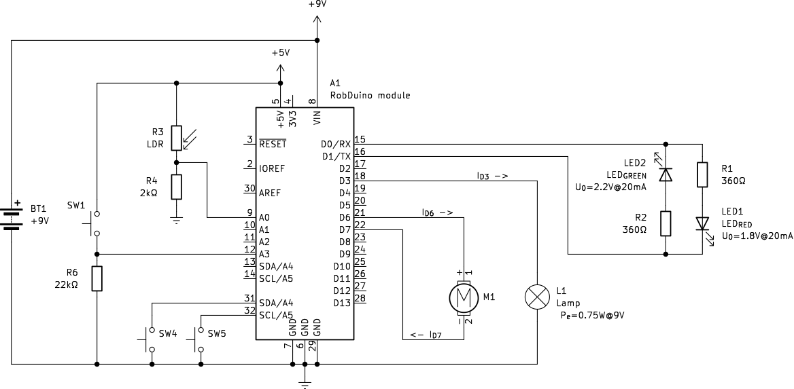

 Ohm's Law
--------------------------------------------------------------------------------

Ohm's Law is a foundational principle in the field of electronics, stating the relationship between voltage, current, and resistance in an electrical circuit. It is succinctly expressed as [@eq:ohms_law]:

$$ I = \frac{R}{V} $${#eq:ohms_law}

where: 

- I is the current flowing through the circuit (in amperes), and 
- V is the voltage across the circuit (in volts), 
- R is the resistance (in ohms).

**Practical Example in Robotics**:

{#fig:RobDuino_Basics_Electronics}

1. Consider a simple robotic arm that uses a DC motor for movement ([@fig:RobDuino_Basics_Electronics]). If the motor has a resistance of $20 \Omega$ and is connected to a 9V power supply, Ohm's Law can determine the current flowing through the motor:

$$ I_{motor} = \frac{9V}{10\Omega} = 450 mA $$

Understanding this helps in selecting the right power source and ensuring that the motor and control electronics are compatible, preventing overheating and damage.

2. To apply Ohm's Law in calculating the current flowing through a light lamp with a power rating of 0.75W at a supply voltage of 9V, and connected to a digital output (D3), we start by understanding the relationship between power, voltage, and current. Ohm's Law is traditionally stated as [@eq:ohms_law], but we can also express electrical power (Pe) in terms of voltage and current as [@eq:electrical_power]:

$$ P_e = V I $${#eq:electrical_power}

Since we are again interested in electrical current trough lamp we can fill in the data:

$$ I_{D3} = \frac{P_e}{V} = \frac{0.75W}{9V} = 83 mA $${#eq:povwer_d3}

### Questions

1. Calculate electrical current trough resistor $R_1$ if the voltage across it is $U_{R_1}=7.2V$!
2. Calculate the current trough resistor $R_4$ if measured voltage potential on $A_0$ pin is $V_{A_0} = 2V$!
