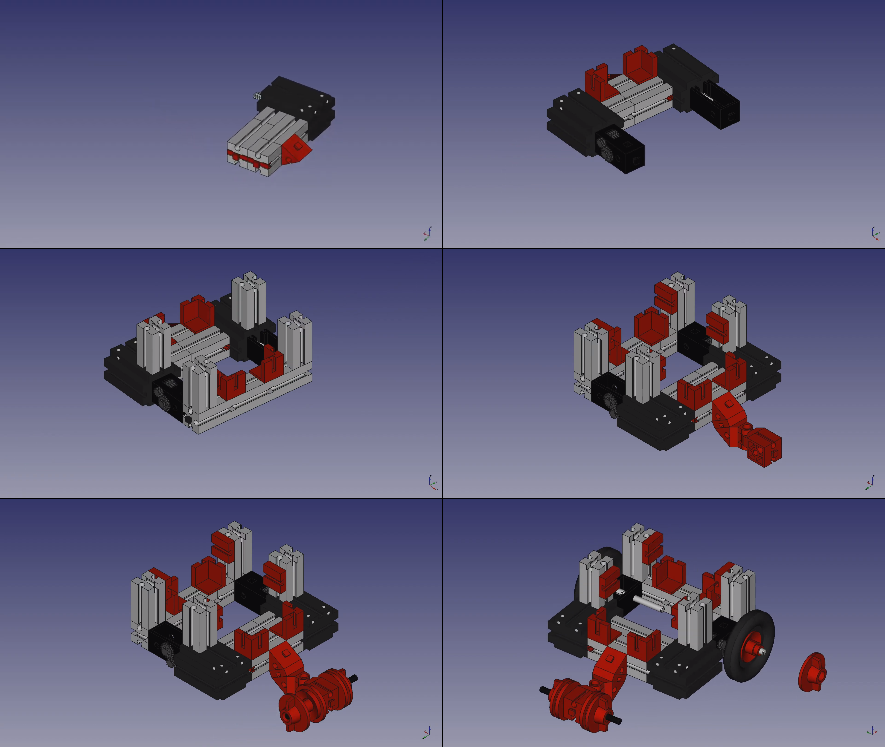

## Robot construction

Building a functional robot is a crucial step in understanding robotics hardware. In this learning unit, we will focus on assembling a mobile robot using **Fischertechnik** components, a modular construction system widely used in robotics education.  

**Why Fischertechnik?**  

Fischertechnik is a **high-quality, engineering-focused construction system** designed to teach mechanical and technical principles. Unlike simpler building kits, such as LEGO, Fischertechnik provides **greater mechanical accuracy and modularity**, making it ideal for robotics prototyping.  

- **Mechanical Stability** – The system uses interlocking parts that provide excellent structural integrity, ensuring that robots remain durable even in moving applications.  
- **Precision and Functionality** – Fischertechnik components include gears, axles, sensors, and motors, allowing students to construct robots that function similarly to real-world industrial machines.  
- **Realistic Engineering Design** – Unlike snap-together toys, Fischertechnik encourages **engineering-oriented thinking**, requiring students to assemble parts in ways that mimic professional robotics design.  
- **Integration with Electronics** – Fischertechnik models can incorporate **microcontrollers (e.g., RobDuino, Arduino)** and sensors, bridging the gap between mechanical assembly and programming.  
- **Flexibility for Modifications** – The modular nature of the system allows for easy redesigns and upgrades, making it perfect for experimentation.  

By using Fischertechnik, students **develop hands-on problem-solving skills**, reinforce their understanding of mechanics, and gain practical experience in constructing **stable, functional robotic systems**.  

In the next steps, you will **follow a structured assembly guide** to construct your first mobile robot, install its power source, and integrate the **RobDuino controller**, which will later be programmed to perform autonomous tasks.

### Task: Assemble robot construction

1. Construct the mobile robot according to this sequences on the [@fig:construction].

{#fig:construction}

Or you can follow the video [instructions](https://youtu.be/bybqvos4xYk)

2. Add the battery between the red cornered bricks. The connector shuld
    be pointing to the back of the robot.
3. Add also the RobDuino controller. Clip the controller between the grey upstanding bricks.

### Questions:

1.  Where do you think is th front side of the robot?
2.  Are you able to rotate the wheels freely by hand?

<!--
slika iz YouTuba
<iframe width="410" height="230" frameborder="0" src="https://www.youtube.com/embed/bybqvos4xYk"></iframe>
{#fig:fff}
-->

### Summary:
<++>

### Issues:

### **Issues:**  

**Incorrect Height Adjustment of the Rear Support Wheel**  
   - Ensure that the **rear support wheel is positioned at the correct height** so that its **rotation axis remains perfectly vertical**.  
   - An incorrect height may cause **unwanted tilting**, leading to unstable movement.  

**Misalignment of Wheels and Axles**  
   - Check that the **driving wheels** are **securely attached** and properly aligned with the chassis.  
   - A misaligned axle can cause uneven movement or excessive friction, reducing efficiency.  

**Loose or Improperly Fastened Components**  
   - Ensure all structural components, including the **RobDuino controller and battery**, are **firmly clipped into place**.  
   - Loose parts may cause mechanical instability, electrical disconnections, or unexpected behavior.  

**Battery Orientation and Connector Placement**  
   - The **battery should be correctly positioned** between the red cornered bricks, with the **connector facing the back of the robot**.  
   - Incorrect placement may make wiring difficult or even prevent proper power delivery.  

**Wheel Rotation and Friction Issues**  
   - Before finalizing assembly, **manually rotate the wheels** to ensure they spin **freely** without obstruction.  
   - If the wheels do not rotate smoothly, check for excessive tension in the axle or misaligned parts.  

By carefully addressing these points during assembly, you will **improve the robot’s stability, movement, and overall performance**, ensuring a successful build.

