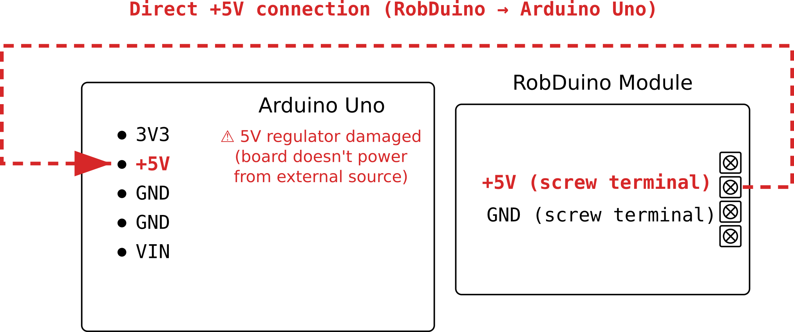

 

 Basic circuit components
--------------------------------------------------------------------------------

### Resistors

### Diodes

### Power source

When it comes to powering an Arduino UNO controller for robotics projects, there are several options available depending on the specific requirements of your project. Here are some common power supply options:

1. USB Cable: The simplest and most common way to power an Arduino UNO is through a USB cable connected to a computer or a USB power source, such as a wall adapter or power bank. This is convenient for testing and prototyping, but it may not be suitable for mobile or standalone robot applications.

2. External Power Supply: The Arduino UNO can also be powered by an external power supply connected to its power jack. The board accepts a voltage range of 7 to 12 volts. You can use a DC power adapter or a battery pack with the appropriate voltage rating. Make sure the power supply can provide enough current to meet the requirements of your project.

3. 9V Battery: Another option is to power the Arduino UNO using a 9V battery. You can connect the battery to the power jack or use a battery clip to connect it to the Vin (voltage input) and GND (ground) pins on the Arduino board. Keep in mind that a 9V battery may not provide sufficient power for more demanding robotic applications.

4. LiPo Battery: For mobile or portable robot projects, lithium polymer (LiPo) batteries are a popular choice. LiPo batteries provide higher energy density and can deliver the necessary current for driving motors and other power-hungry components. However, you will need additional circuitry, such as voltage regulators and protection circuits, to ensure proper voltage levels and prevent overcharging or over-discharging of the battery.

When choosing a power supply, consider the voltage and current requirements of your Arduino UNO and the peripherals connected to it, such as motors, sensors, and other components. Ensure that the power supply can provide enough current and voltage stability for your specific project needs.

Always prioritize safety when working with power supplies. Use appropriate connectors, check polarity, and follow proper wiring practices to prevent short circuits or damage to your Arduino UNO and other components.

#### Battery UPS power supply

We utilize Uninterruptible Power Supply (UPS) power supply units such as the one available on AliExpress (see [@fig:UPS_Power_Spply]). These UPS units are specifically employed for providing power to simple mobile robots. They offer a cost-effective solution, allowing us to ensure uninterrupted power supply to the robots' systems. The chosen UPS units from AliExpress are reliable and affordable, making them an ideal choice for our requirements.

![UPS power supply[^UPS_Power_Spply].](./slike/UPS_Power_Spply.png){#fig:UPS_Power_Spply}

[^UPS_Power_Spply]: Source: https://www.aliexpress.com/item/1005005452676689.html?spm=a2g0o.productlist.main.19.455b3926DHH1L4&algo_pvid=de392f56-63b1-4837-96de-e710e8a0eb9a&aem_p4p_detail=202311030140378048689945398110001719497&search_p4p_id=202311030140378048689945398110001719497_2

The UPS described in the provided schema ([@fig:Schematic_Aether_LI-M-3P-D_2023-11-03]) is designed in such a way that the output voltage is controlled by a resistor divider circuit consisting of resistors R7 and R9.

![Schematic of UPS[^schema_UPS_link].](./slike/Schematic_Aether_LI-M-3P-D_2023-11-03.png){#fig:Schematic_Aether_LI-M-3P-D_2023-11-03}

[^schema_UPS_link]: Source: https://oshwlab.com/xordata/aether-li-m-3p-d

In this UPS schema, the resistors R7 and R9 are chosen in a way that their ratio divides the voltage proportionally to achieve the desired output voltage. By adjusting the values of these resistors, the output voltage can be regulated.

In addition to the regular setup, we incorporated an extra switch between the BAT+ (battery positive) and R3 resistor in power supply system. This switch serves the purpose of powering off the UPS (uninterruptible power supply). This feature provides convenience as it allows us to easily turn off the mobile robot and put the UPS into charging mode. By using this switch, we can efficiently manage the power supply to the robot and ensure that the UPS is charged when not in use.

### Issues:

#### Arduino Uno does not run when disconnected from USB

Sometimes students notice that the Arduino Uno works only when connected to the USB cable, but does not run when powered from an external battery alone, even though the battery voltage is correct.

A common reason is a damaged 5V voltage regulator on the Arduino Uno board. If the regulator fails, the ATmega328 microcontroller does not receive the required 5V supply and therefore cannot execute the program.

**Quick fix**:
Connect the +5V output provided by the RobDuino module (screw terminal +5V) directly to the Arduino’s +5V pin header. This bypasses the faulty regulator and powers the microcontroller directly.

{#fig:QuickFix_Arduino_RobDuino_editable width=14cm}

**Permanent solution**:
Replace the defective 5V regulator on the Arduino Uno board. This restores normal operation and ensures the board can again be powered from batteries or an external power supply without relying on the USB port.

