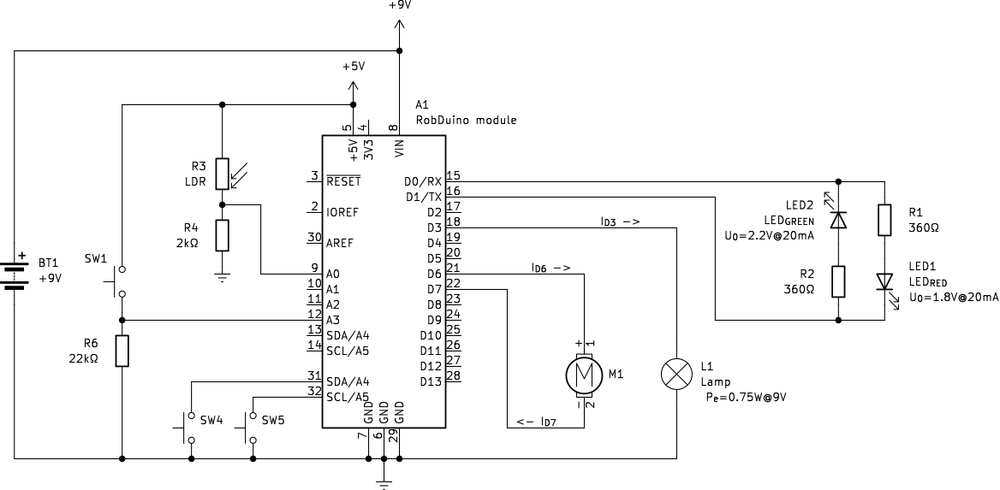

 Kirchhoff's Current Law
--------------------------------------------------------------------------------

Kirchhoff's Current Rule, also known as the first Kirchhoff ~~law~~ rule, states that the total current entering a junction in a circuit equals the total current leaving the junction. This law is based on the principle of conservation of charge and is expressed with [@eq:kcl]:

$$ I_{x_1} + I_{x_2} + ... = I_{y_1} + I_{y_2} + I_{y_3} + ... $${#eq:kcl}

where:

- electrical currents with index $I_x$ are entering currents and
- currents with index $I_y$ are leaving junction currents.

We will explain the Kirchhoff's current rule on the same example shown in [@fig:RobDuino_Basics_Electronics_KCL]

{#fig:RobDuino_Basics_Electronics_KCL}

**Practical Example in Robotics**:

Imagine a robotic hand with multiple sensors (e.g., touch sensor and light sensor) connected to a single microcontroller. If the sensors draw 0.23 mA (when $SW_1$ is closed) and 1.0 mA, and they are all connected to the same power supply junction, the total current entering the junction is:

$$ I_{tot} = I_{tch} + I_{light} = 0.23mA + 1.0mA = 1.23mA $${#eq:i_tot}

This information is critical for designing the power distribution network of the robot, ensuring that the power supply can handle the total current draw.

### Questions

1. What is the total current of actuators (motor, light bulb, LEDs) when they are all on?
2. Current into input pin $A_0$ is approximately $I_{A_0} = 20 nA$. Compare this current to other two currents at the middle junction in the light sensor. Can it be ignored?

