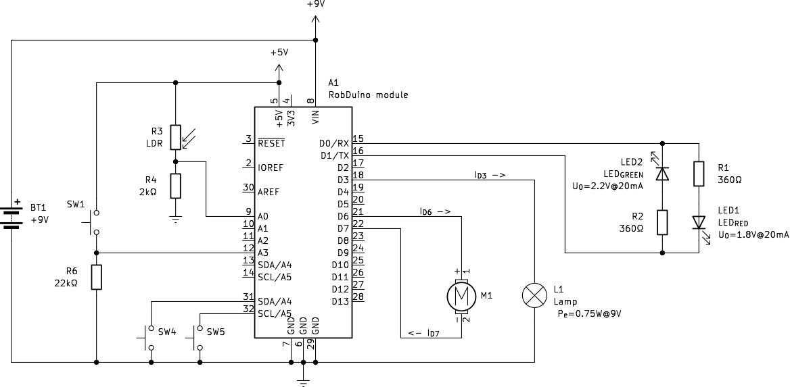

 Kirchhoff's Voltage Rule
--------------------------------------------------------------------------------

Kirchhoff's Voltage Rule, or the second Kirchhoff rule, states that the sum of all electrical potential differences around any closed network (or loop) is zero. This law is grounded in the conservation of energy principle and is expressed wiht [@eq:kvl]

$$ +U_1 - U_2 + ... + U_n = 0 $${#eq:kvl}

where:

- voltage is positive if voltage potential increases in the selected direction (e.g. $U_1$)  and
- voltage is negative if voltage potential decreases in this direction (e.g. $U_2$).

**Practical Example in Robotics**:

{#fig:RobDuino_Basics_Electronics_kvl}

Consider a circuit in a robotic device that includes an LED circuit as a signal light (e.g., $D_0 \rightarrow R_1 \rightarrow LED_1 \rightarrow D_1$. If we assume that across output pins $D1$ and $D_0$ is a positive voltage potential difference $U_{(D_1-D_0)} = 9V$, according to KVL, we can write an [@eq:kvl_ex1] for this loop:

$$ U_{(D_1-D_0)} - U_{R_1} - U_{LED_1} = 0V $${#eq:kvl_ex1}

Rearranging [@eq:kvl_ex1] we can calculate the voltage across resistor $R_1$:

$$ U_{R_1} = U_{(D_1-D_0)} - U_{LED_1} = 9V-1.8V=7.2V$${#eq:u_res_1}

This ensures that the energy supplied by the controller is completely used by the resistor and led. Kirchhoff's voltage rule is instrumental in analyzing and designing circuits for energy efficiency and proper component operation in robotics.

Understanding the basic principles of electricity and electronics, epitomized by Ohm's Law and Kirchhoff's rules, is crucial for anyone venturing into robotics. These principles not only guide the design and analysis of robotic systems but also ensure their safe and efficient operation. By applying these laws, we can predict how circuits will behave under various conditions, optimize energy consumption, and troubleshoot potential issues, laying the groundwork for more advanced explorations into the electrifying world of robotics.

### Questions

1. Calculate the voltage across resistor $R_2$ when voltage potencial of $V_{D0}=0V$ and voltage potencial of $V_{D1}=9V$!
2. What is the voltage across resistor $R_3$ if we measured voltage potencial $V_{A_0}=2V$ at the input pin $A_0$?

