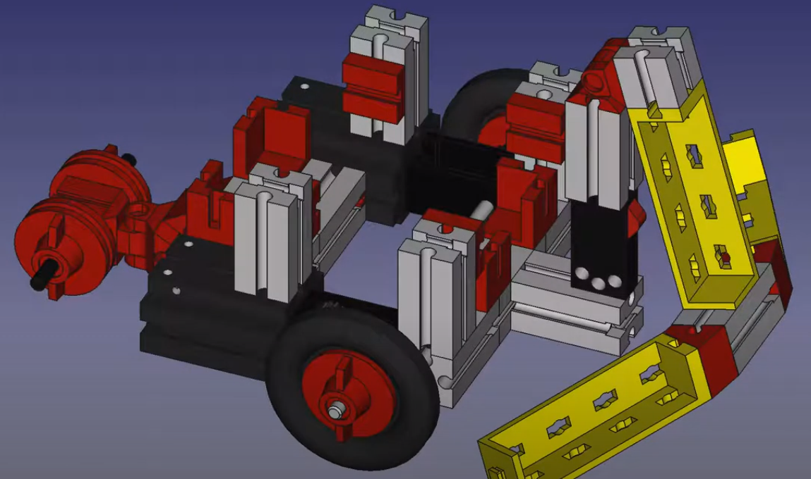

 Flow control
--------------------------------------------------------------------------------
Flow control in C++ programming is the mechanism that allows the execution path of a program to change based on conditions, loops, or jumps. It is fundamental to creating dynamic and responsive programs. The primary ways to control flow in C++ include:

- Jump Statements: Facilitate the control flow by jumping to other parts of the program. The break, continue, and goto statements are examples of jump statements.
- Loop Statements: Enable executing a block of code repeatedly as long as a condition remains true. C++ offers for, while, and do-while loops for this purpose.
- Conditional Statements: Direct the program flow based on boolean conditions. Examples include if, if-else, and switch statements.
-
The `goto` statement in C++ provides a way to jump to another part of the program, altering the normal sequential flow of execution. It's generally recommended to use goto sparingly, as it can make code harder to read and maintain, but it can be useful in certain contexts, such as breaking out of deeply nested loops.

### Tasks:

//to do... primer za ponavljanje kode...

```cpp
void setup()
{
  Serial.begin(115200);

label move:
  setIOpins();
  moveForward();
  delay(3000);
  stopTheRobot();
goto move  
}

void loop()
{

```

### Tasks:

1. Construct the bumper of the robot with push-button-switch as is shown in [this video instructions](https://www.youtube.com/watch?v=eWldNxh-q2c&t=11s).

2. And connect the push-button-switch (PBSW) terminals with module RobDuino according to [@tbl:SW-RobDuino]:

| PBSW con. | RobDuino connectors |
|:---------:|:-------------------:|
|   No. 1   |          A0         |
|   No. 2   |         GND         |
|   No. 3   |         +5V         |

Table: Connection of push-button-switch to the Robduino module. {#tbl:SW-RobDuino}

<iframe src="https://docs.google.com/presentation/d/19d-8UN3UQ1HTpq4a4PhSgt14YnIC8EE5Y1nDjwUab2Y/embed?authuser=0&hl=en&size=s" width="410" height="337" title="Conection of distance sensor" frameborder="0" allowfullscreen="true" mozallowfullscreen="true" webkitallowfullscreen="true"></iframe>

3. Test the push-button-switch in the bumper with next [@lst:260_Conditional_Statements]:

```cpp
const int BUMPER_PIN          = A0;
const int TEST_BUMPER_LED_PIN = 3;
void setup()
{
  pinMode(BUMPER_PIN, INPUT);
  pinMode(TEST_BUMPER_LED_PIN, OUTPUT);
}

void loop()
{
  bool bumperIsPressed = digitalRead(BUMPER_PIN);
  if ( bumperIsPressed ) digitalWrite(TEST_BUMPER_LED_PIN, HIGH);
}
```
: Conditional Statements. {#lst:260_Conditional_Statements}

<!--
{#fig:bumper_construction}
-->

2. Then\... complete the program to turn OFF the LED when the bumper is not touching anything.
3. Next\... Change IF statements into single one IF-THEN-ELSE statement.

### Questions:

1. Check if the LED on the output terminal D3 is ON when the bumper is pressed.
2. Measure the voltage potencial at the terminal A0 when the bumper is pressed.
3. Explain when the curly braces `{}` are necessary in the if-statement.

### Summary:

Flow control in C++ programming is a fundamental concept that allows developers to dictate how and when certain blocks of code are executed. It enables the creation of dynamic and responsive programs that can make decisions, repeat operations, and jump to different parts of the code based on certain conditions. The primary constructs for controlling the flow of a C++ program are conditional statements, loops, and jump statements.

#### **Conditional Statements**

Conditional statements evaluate a condition and then execute a block of code based on whether the condition is true or false. The most common conditional statements in C++ are if, else if, and else.

**IF Statement** can be written in several forms. The easiest one is:

```cpp
if (value_one) statement1;
```

In this case the variable named `value_one` can hold some numerical number. If `value_one` is `true` or greater than `0` the program will execute `statement1`.
But this simple example is not used so often due its simplicity. We rather use it in
this form:

```cpp
if ( value_one == value_two ){
  statement1;
  statement2;
}
```
In this case `value_one` can be any number and the `statement1` and `statement2` will be executed if the `value_one` will be equal to `value_two`. These command can be expanded into IF-ELSE form:
```cpp
if ( value_one == value_two ){
  statement1;
  statement2;
}else{
  statement3;
}
```

An else if ladder can be used to decide among multiple conditions.

```cpp
if (condition1) {
    // Code to execute if condition1 is true
} else if (condition2) {
    // Code to execute if condition2 is true
} else {
    // Code to execute if none of the above conditions is true
}
```
**SWITCH** statemen

The switch statement allows you to execute one block of code out of many, based on the value of a variable. It's often more convenient than multiple if-else statements when dealing with variable values.

```cpp
int x = 2;

switch (x) {
  case 1: printf("x is 1"); break;
  case 2: printf("x is 2"); break;
  case 3: printf("x is 3"); break;
  default: printf("x is something else"); break;
}
```

In this example, the switch statement checks the value of x and executes the code block corresponding to the first case label that matches the value. The break statements are used to exit the switch statement once a match is found. If no match is found, the code block for the default label is executed.

**Condition operators**

Also other logical condition operators can be used:

- Less than: `a < b`
- Less than or equal to: `a <= b`
- Greater than: `a > b`
- Greater than or equal to: `a >= b`
- Equal to `a == b`
- Not Equal to: `a != b`

#### **Loops**

Loops are used to repeat a block of code multiple times. C++ provides several types of loops to handle different scenarios:

**For Loop**: Executes a block of code a specific number of times.
```cpp
for (initialization; condition; increment) {
    // Code to execute
}
```

**While Loop**: Executes a block of code as long as a condition remains true.
```cpp
while (condition) {
    // Code to execute
}
```

**Do-While Loop**: Similar to the while loop, but it executes the block of code at least once before checking the condition.

```cpp
do {
    // Code to execute
} while (condition);
```

#### **Jump Statements**

Jump statements allow the program to jump to another part of the code. The primary jump statements are break, continue, and return. However, there's another jump statement known as goto, which is generally discouraged.

`break`: Exits the loop immediately.  
`continue`: Skips the remaining code in the current iteration and proceeds with the next iteration of the loop.  
`return`: Exits the current function and optionally returns a value.  

`goto`: The goto statement provides an unconditional jump from the goto to a labeled statement in the same function. It is rarely used in modern C++ programming because it can make the code less readable and harder to maintain. The use of goto can lead to "spaghetti code," where the flow of execution jumps around the program erratically, making it difficult to trace and debug.

```cpp
goto label;
// Some code here
label:
// The code to jump to
```

Why avoid goto:

- **Readability**: goto statements can significantly harm the readability of code. They break the structured flow of the program, making it difficult for developers to follow the logic.
- **Maintainability**: Programs that use goto extensively are harder to modify and maintain. Understanding the flow of such programs requires more effort, and making changes can introduce bugs if the jumps are not carefully managed.
- **Debugging**: Debugging issues in code that uses goto can be more challenging because the erratic flow makes it harder to pinpoint where things go wrong.


In conclusion, while C++ supports a wide range of flow control mechanisms to handle various programming needs effectively, it's crucial to use these constructs wisely to maintain code clarity and integrity. The goto statement, despite being a part of the language, is best avoided in favor of more structured and readable control flow constructs.

### Issues:

#### *<++>*

<++>

