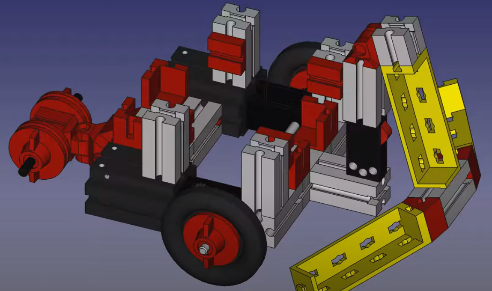

 Conditional Statements
--------------------------------------------------------------------------------

Conditional statements in C++ are foundational constructs that allow programmers to execute specific sections of code based on certain conditions. These statements enable decision-making within a program, allowing it to respond differently to various inputs or situations. The most commonly used conditional statements in C++ are if, else if, and else.

Imagine you are programming a mobile robot that uses a bumper sensor to detect obstacles. The bumper sensor can return two states: 0 (no contact), 1 (contact with the obstacle). Based on the sensor's input, the robot should make decisions: stop moving forward when an obstacle is detected and adjust its path accordingly. This will be our future task in next chapter. First we have to construct robot's bumper with push button key and test it.

### Tasks:

1. Construct the bumper of the robot with push-button-switch as is shown in [this video instructions](https://www.youtube.com/watch?v=eWldNxh-q2c&t=11s).

2. And connect the push-button-switch (PBSW) terminals with module RobDuino according to [@tbl:SW-RobDuino]:

| PBSW con. | RobDuino connectors |
|:---------:|:-------------------:|
|   No. 1   |          A0         |
|   No. 2   |         GND         |
|   No. 3   |         +5V         |

Table: Connection of push-button-switch to the Robduino module. {#tbl:SW-RobDuino}

<iframe src="https://docs.google.com/presentation/d/19d-8UN3UQ1HTpq4a4PhSgt14YnIC8EE5Y1nDjwUab2Y/embed?authuser=0&hl=en&size=s" width="410" height="337" title="Conection of distance sensor" frameborder="0" allowfullscreen="true" mozallowfullscreen="true" webkitallowfullscreen="true"></iframe>

3. Test the push-button-switch in the bumper with next [@lst:260_Conditional_Statements]:

```cpp
const int BUMPER_PIN          = A0;
const int TEST_BUMPER_LED_PIN = 3;
void setup()
{
  pinMode(BUMPER_PIN, INPUT);
  pinMode(TEST_BUMPER_LED_PIN, OUTPUT);
}

void loop()
{
  bool bumperIsPressed = digitalRead(BUMPER_PIN);
  if ( bumperIsPressed ) digitalWrite(TEST_BUMPER_LED_PIN, HIGH);
}
```
: Conditional Statements. {#lst:260_Conditional_Statements}

<!--
{#fig:bumper_construction}
-->

2. Then\... complete the program to turn OFF the LED when the bumper is not touching anything.
3. Next\... Change IF statements into single one IF-THEN-ELSE statement.
4. Complete the IF-statement with a block of code so that the LED will blink when the bumper is pressed.

### Questions:

1. Check if the LED on the output terminal D3 is ON when the bumper is pressed.
2. Measure the voltage potencial at the terminal A0 when the bumper is pressed.
3. Explain when the curly braces `{}` are necessary in the if-statement.

### Summary:

Conditional statements in C++ programming are utilized for flow control within a program. These statements allow the program to make decisions and execute certain blocks of code based on specified conditions. The primary conditional statements in C++ include `if`, `if-else`, nested `if-else-if`, and `switch-case`.

`If` executes a block of code if a specified condition is true.

`If-else` provides an alternate block of code if the initial condition is false.

Nested `if-else-if` involves multiple layers of if-else conditions within one another for complex decision making.

`Switch-case` allows a variable to be tested for equality against a list of values and executes the first match.

Thus, conditional statements provide essential control flow mechanisms in C++ programming.

#### IF, IF-ELSE, IF-ELSE-IF

can be written in several forms. The easiest one is:

```cpp
if (value_one) statement1;
```

In this case the variable named `value_one` can hold some numerical number. If `value_one` is `true` or greater than `0` the program will execute `statement1`.
But this simple example is not used so often due its simplicity. We rather use it in
this form:

```cpp
if ( value_one == value_two ){
  statement1;
  statement2;
}
```
In this case `value_one` can be any number and the `statement1` and `statement2` will be executed if the `value_one` will be equal to `value_two`. These command can be expanded into IF-ELSE form:
```cpp
if ( value_one == value_two ){
  statement1;
  statement2;
}else{
  statement3;
}
```

An else if ladder can be used to decide among multiple conditions.

```cpp
if (condition1) {
    // Code to execute if condition1 is true
} else if (condition2) {
    // Code to execute if condition2 is true
} else {
    // Code to execute if none of the above conditions is true
}
```

#### SWITCH statement

The switch statement allows you to execute one block of code out of many, based on the value of a variable. It's often more convenient than multiple if-else statements when dealing with variable values.

```cpp
int x = 2;

switch (x) {
  case 1: printf("x is 1"); break;
  case 2: printf("x is 2"); break;
  case 3: printf("x is 3"); break;
  default: printf("x is something else"); break;
}
```

In this example, the switch statement checks the value of x and executes the code block corresponding to the first case label that matches the value. The break statements are used to exit the switch statement once a match is found. If no match is found, the code block for the default label is executed.

#### Condition operators

Also other logical condition operators can be used:

- Less than: `a < b`
- Less than or equal to: `a <= b`
- Greater than: `a > b`
- Greater than or equal to: `a >= b`
- Equal to `a == b`
- Not Equal to: `a != b`

### Issues:

#### *<++>*

<++>

