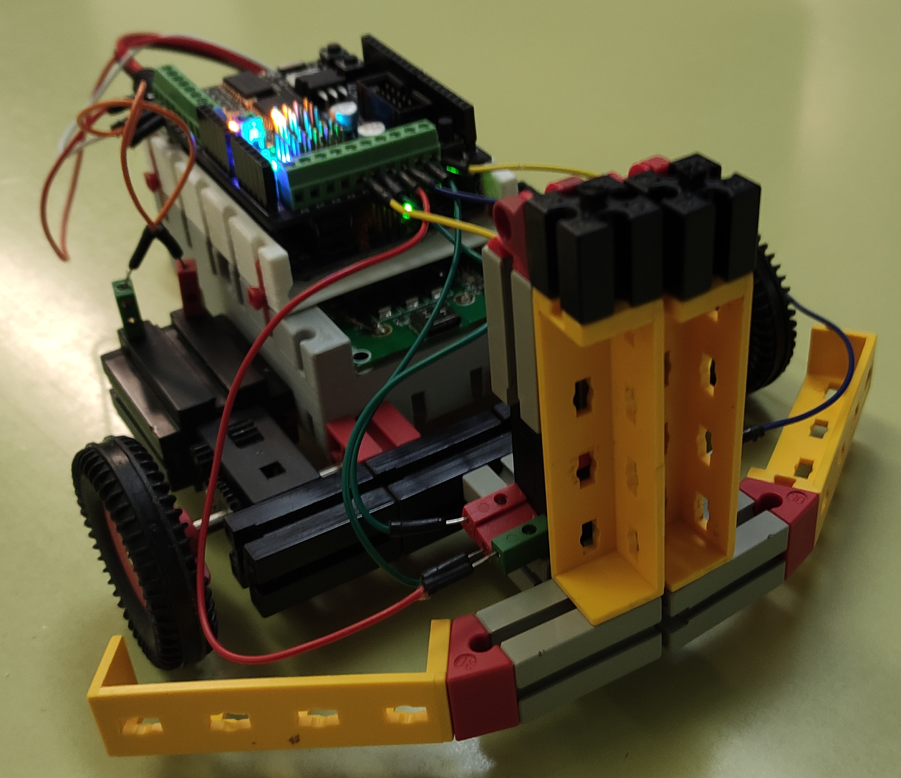

## S-R-A loop

S-R-A loop is repeating process where:

1. Sensing,
2. Reasoning and
3. Acting

is involved during the procedure of controlling the robot. This is the most important part of software in robotics. Remember the `autonomous` control is `ability to perform intended tasks based on current state and sensing, without human intervention`.

The S-R-A loop is a common design pattern in robotics. It refers to the process of using sensors to gather information about the environment, processing the information to determine an appropriate response, and then executing the response using actuators.

Here is an pseudo example of how the S-R-A loop could be implemented in C++:

```cpp
while (true) {
  // 1. Sense the environment using sensors
  sensor_data = gatherSensorData();

  // 2. Process the sensor data to determine an appropriate response
  response = processSensorData(sensor_data);

  // 3. Execute the response using actuators
  executeResponse(response);
}
```

In this example, the `gatherSensorData` function is used to gather data from the robot's sensors, the `processSensorData` function is used to determine an appropriate response based on the sensor data, and the `executeResponse` function is used to execute the response using the robot's actuators. The loop is executed continuously, allowing the robot to constantly sense and respond to its environment.

### Tasks:

1. Using the S-R-A loop technique you should write the program in particular order:
    1.  Check the sensor. IF the bumper \...
    2.  \... Is pressed the robot has to stop/go back/turn.
    3.  \... Is not pressed the robot can drive forward.

    Test the [@lst:270_SRA_Loop] and **find out why the robot does not stop.** (Such mistake is quite often - can you fix it):

```cpp
#include <RobotMovingFunctions.h>
const int BUMPER_PIN = A0;
void setup()
{
  setIOpins();
  pinMode(BUMPER_PIN, INPUT);

  bool bumperIsPressed = digitalRead(BUMPER_PIN);
  if ( bumperIsPressed )
  {
    stopTheRobot();
  }
  else
  {
    moveForward();
  }
}
void loop()
{
}
```
: SRA Loop. {#lst:270_SRA_Loop}

2. Hint for fixing the [@lst:270_SRA_Loop]: _S-R-A must be a loop function!_
3. Write a program to drive the robot around the class and avoid the obstacles.
4. Make split bumper design (left and right) as presented in [@fig:rob_50] and write a program so that the robot avoids the obstacle depending on which side the obstacle is present.

{#fig:rob_50 width=8cm}

### Questions:

1. What for `S-A-R loop` stands for?
2. Mark all three basic S-A-R processes in previous code example.
3. Can the `line 8` of the [@lst:270_SRA_Loop] be written outside of `loop()` function? What would happened if so?

### Summary:

#### <++>

<++>

### Issues:

#### *<++>*

<++>  

