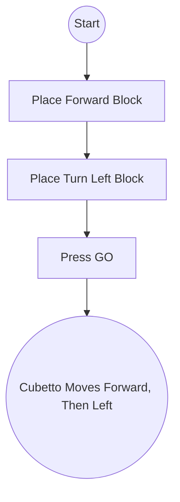
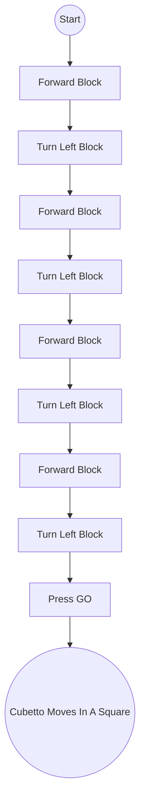

 BASIC NAVIGATION
================================================================================

1. Learning Objectives
Understand Cubetto’s directional blocks (forward, turn right, turn left).
Practice creating a short command sequence.
Develop spatial awareness and simple problem-solving.

2. Materials
Cubetto robot and control board
Forward block (usually green)
Turn left block (usually yellow)
Turn right block (usually red)
A small grid mat or any flat surface

3. Activity Steps
Introduction (3–5 minutes)

Briefly review how to put blocks in the board and press “Go.”
Ask children what they think each block does.
Main Exercise (5–10 minutes)

Place a small toy or sticker on the mat.
Challenge children to move Cubetto from the “Start” tile to the toy’s tile using only three or four moves.
Example sequence: forward → forward → turn left → forward.
Try Variations (5 minutes)

After success, have them alter the path: maybe turn right first, then forward twice, and so on.
Emphasize trial and error.

Below is a longer sequence to approximate a little square path (though each turn might need an extra forward block depending on the size of your map).

These examples help children visualize step-by-step instructions. You would, in practice, place the colored blocks on Cubetto’s control board in exactly this sequence, then press “Go” to watch Cubetto carry them out.

Enjoy exploring basic navigation with Cubetto!

4. Reflection and Wrap-Up
Ask each child: “What did Cubetto do first? What happened after?”
Highlight how the blocks made Cubetto move step by step.
Reinforce the idea of sequence and order of commands.
