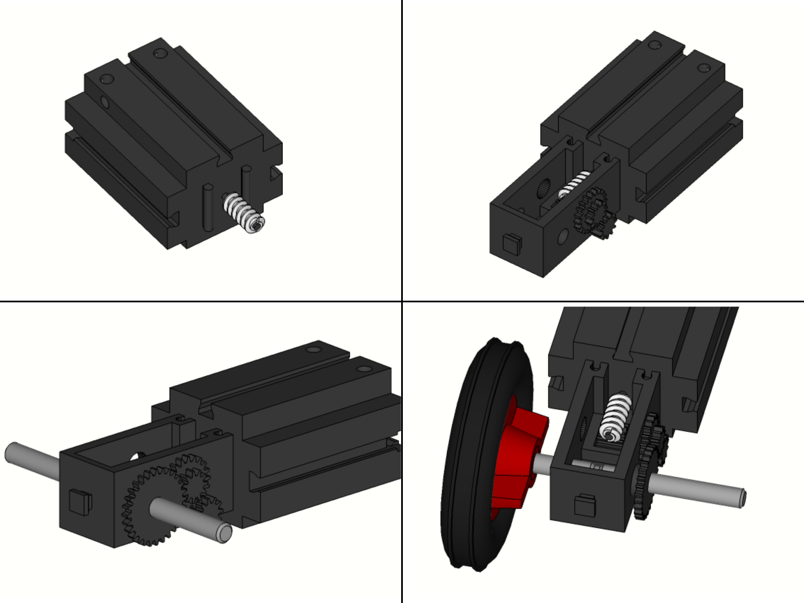

## GEAR REDUCER

### Task:

1. Add geared reductor to DC motor.
2. Try to stop the shaft of the geared reductor and compare your fillings with the stopping the motor shaft.

### Questions:

1.  How difficult is to stop the shaft of the reductor in comparison to motor shaft?
2.  How fast the shaft of the reductor is spinning in comparison to the shaft of the motor?
3.  Are you able to freely rotate the shaft of the reductor by hand?
4.  What happened with the produced mechanical power?
5.  Try to calculate the geared ratio of the reducer.

### Summary

#### Gear ratio

The gear ratio describing the ratio between the angular velocity of
input gear G1 and angular velocity of output gear G2.  
$$ { i=\frac{\omega_1}{\omega_2} } $$  
Because each gear moves tooth per tooth and if two touching gears have different numbers of teeths their\'s angular velocity will be different.
In fact the anguar velocity will be inversely proportional.  
$$ {\frac{\omega_1}{\omega_2}=\frac{N_2}{N_1}=i} $$

### Issues

#### *The reductor\'s shaft is not spinning although the DC motor is working properly.*

Check if the reductor is attached all the way to the motor. 
Check if the worm gear of the motor is in contact with first gear of the
roductor.

