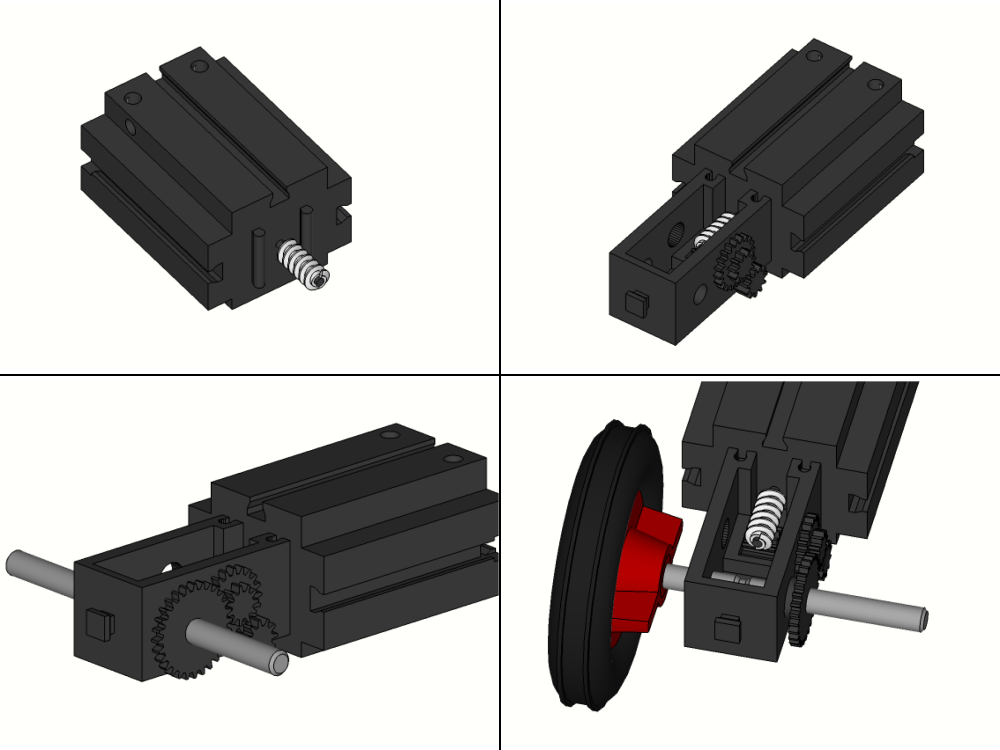
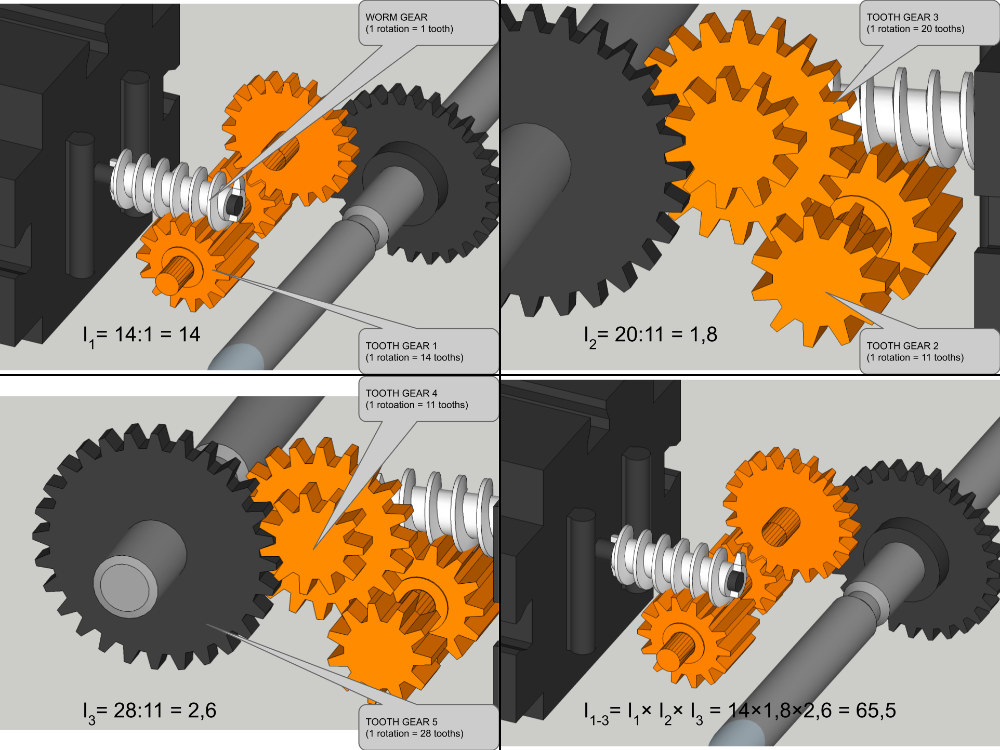

## Gear reducer

Gear reduction is the process of using a set of gears to reduce the speed of a mechanical system while increasing the torque (rotational force). It is commonly used in robotics and other applications where it is necessary to trade speed for power.

There are several ways to achieve gear reduction, but the most common method is to use a gear train, which is a series of interconnected gears that transmit motion from one gear to another. By using gears with different sizes and ratios, it is possible to reduce the speed of the output gear while increasing the torque.

For example, consider a simple gear train with two gears: a larger driving gear (Gear A) and a smaller driven gear (Gear B). If the driving gear has 10 teeth and the driven gear has 20 teeth, the gear reduction ratio will be 2:1 (Gear B will rotate at half the speed of Gear A, but with twice the torque).

Here is the formula for calculating the gear reduction ratio:

$$  Gear reduction ratio = \frac{Number of teeth on driving gear}{Number of teeth on driven gear} $${#eq:gear_eq}

### Task:

1. Add geared reductor to DC motor.
2. Try to stop the shaft of the geared reductor and compare your fillings with the stopping the motor shaft.

### Questions:

1.  How difficult is to stop the shaft of the reductor in comparison to motor shaft?
2.  How fast the shaft of the reductor is spinning in comparison to the shaft of the motor?
3.  Are you able to freely rotate the shaft of the reductor by hand?
4.  What happened with the produced mechanical power?
5.  Try to calculate the geared ratio of the reductor.

### Summary

#### Gear ratio

The gear ratio describing the ratio between the angular velocity of
input gear G1 and angular velocity of output gear G2.  
$$ { i=\frac{\omega_1}{\omega_2} } $$  
Because each gear moves tooth per tooth and if two touching gears have different numbers of teeths their\'s angular velocity will be different.
In fact the anguar velocity will be inversely proportional.  
$$ {\frac{\omega_1}{\omega_2}=\frac{N_2}{N_1}=i} $$

### Issues

#### *The reductor\'s shaft is not spinning although the DC motor is working properly.*

Check if the reductor is attached all the way to the motor. 
Check if the worm gear of the motor is in contact with first gear of the
roductor.

