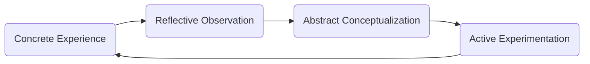

# Experiental learning of Robotics

Robotics education does not occur solely in the context of its own field, but is also an important didactic tool for related and relevant content. Teachers use it to teach science, technology literacy, engineering, and even mathematics. In particular, robotics education has found a place in multidisciplinary education incorporating the above-mentioned areas, which is often abbreviated as Science, Technology, Engineering and Mathematics (STEM) education.

Robotics is defined as an area that incorporates elements from computer science and mechanical and electrical engineering. It follows that its defining characteristics, the so-called S–R–A loop include sensing (related to ELECTRONICS), reasoning (COMPUTER SCIENCE) and acting (related to MECHANICAL ELEMENTS). We believe that these three areas should be emphasized equally in the robotics learning content[^1].

---

[^1]:Rihtaršič, D., Avsec, S. & Kocijancic, S. Experiential learning of electronics subject matter in middle school robotics courses. Int J Technol Des Educ 26, 205–224 (2016). https://doi-org.nukweb.nuk.uni-lj.si/10.1007/s10798-015-9310-7
